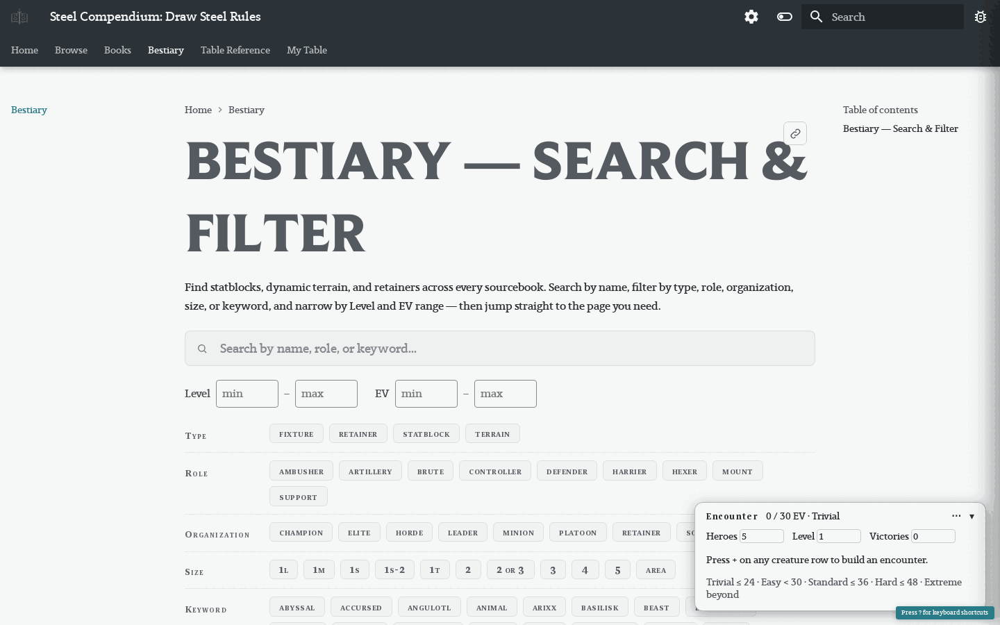

# Steel Compendium Workspace

Orchestration repo for the [Steel Compendium](https://steelcompendium.github.io/) multi-repo project -- a structured, searchable reference for the [Draw Steel](https://www.mcdmproductions.com/draw-steel) TTRPG by MCDM Productions.

## Quick Start

```bash
git clone --recurse-submodules git@github.com:SteelCompendium/workspace.git steelCompendium
cd steelCompendium
devbox shell
just bootstrap
```

Authored sub-repos are **git submodules**; `--recurse-submodules` fetches them on clone, and `just bootstrap` is the idempotent catch-up (submodule init + the regenerable `data/` scratch dir). For parallel/isolated work use `just wt-new <name>` — see [`docs/worktrees-and-submodules.md`](docs/worktrees-and-submodules.md).

## What it looks like

This pipeline produces the live site at [steelcompendium.io/v2](https://steelcompendium.io/v2/):

|  |  |
| --- | --- |
| [Home](https://steelcompendium.io/v2/) — Browse / Read / Bestiary tabs | [Bestiary](https://steelcompendium.io/v2/Bestiary/) — search/filter + encounter builder |

More screenshots (Browse, Read, class pages, statblocks, dark mode) live in [`v2/README.md`](v2/README.md#what-it-looks-like).

## Layout

```
steelCompendium/
  justfile              # Workspace recipes (bootstrap, sync, wt-new/wt-rm/wt-status/wt-finish, deploy*)
  devbox.json           # Devbox environment (Go, Node, Python, just, jq, yq, etc.)
  reference/            # Draw Steel condensed reference docs for AI agents
  steel-etl/            # Go ETL pipeline + site builder — THE source of truth for content
                        #   input/{heroes,beastheart,monsters}/*.md = annotated sources
  v2/                   # MkDocs Material site (v2) — built by `steel-etl site`
  compendium/           # MkDocs Material site (v1, deprecated)
  data-gen/             # Legacy ETL pipeline: PDF -> Markdown (deprecated; reference only)
  data-sdk-npm/         # TypeScript SDK for consuming data repos
  draw-steel-elements/  # Web components for Draw Steel content
  statblock-adapter-gl-pages/  # Statblock rendering adapter
  steelCompendium.github.io/   # Root GitHub Pages site (also hosts the SCC API)
  data/                 # Generated output (gitignored; do not edit). bootstrap clones data-unified
    data-unified/       # The single consolidated published data repo:
                        #   en/books/<book>/<format>  (Read: book-faithful, + clean)
                        #   en/unified/<format>        (Browse: cross-book aggregate)
```

Content flows: annotated `steel-etl/input/*` → `steel-etl gen` → `data/*` → `steel-etl site` → `v2/docs/` → MkDocs build. See `ARCHITECTURE.md` and `steel-etl/README.md`.

## Recipes

| Recipe | Description |
|--------|-------------|
| `just bootstrap` | Initialize submodules + `data/` scratch (idempotent) |
| `just sync` | Pull + move submodules to pinned commits (lockstep) |
| `just wt-new <name>` | Create an isolated worktree env (all submodules on branch `<name>`) |
| `just wt-status <name>` | Show an env's submodules ahead + pending pointer bumps |
| `just wt-finish <name>` | Land an env's work (pushes submodules + superproject main) |
| `just wt-rm <name>` | Tear down an env |
| `just deploy` | Full pipeline: gen + SCC API + v2 site |
| `just deploy-api` | Pipeline + SCC resolution API only |
| `just deploy-v2` | Pipeline + v2 site only |
